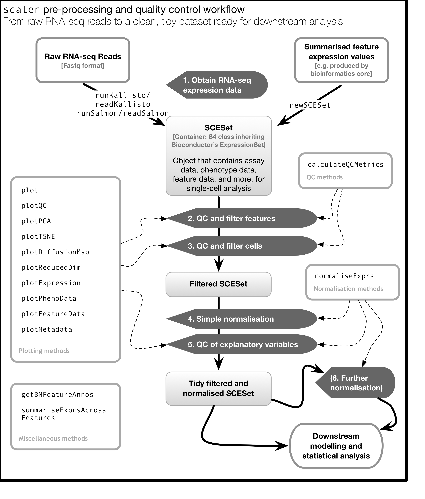

# scater package

## Introduction

[scater](https://github.com/davismcc/scater) is a single-cell analysis toolkit for expression with R. This package contains useful tools for the analysis of single-cell gene expression data using the statistical software R. The package places an emphasis on tools for quality control, visualisation and pre-processing of data before further downstream analysis.

[scater](https://github.com/davismcc/scater) enables the following:

* Automated computation of QC metrics
* Transcript quantification from read data with pseudo-alignment
* Data format standardisation
* Rich visualisations for exploratory analysis
* Seamless integration into the Bioconductor universe
* Simple normalisation methods

We highly recommend to use [scater](https://github.com/davismcc/scater) for any single-cell RNA-seq analysis you will be doing in the future. [scater](https://github.com/davismcc/scater) is the basis of the first part of the course and therefore we will spend some time explaining its details.

## scater workflow

## Terminology

(this chapter is taken from the [scater vignette](https://www.bioconductor.org/packages/devel/bioc/vignettes/scater/inst/doc/vignette.html))

* The capabilities of scater are built on top of Bioconductor’s Biobase.
* In Bioconductor terminology we assay numerous __“features”__ for a number of __“samples”__.
* Features, in the context of [scater](https://github.com/davismcc/scater), correspond most commonly to genes or transcripts, but could be any general genomic or transcriptomic regions (e.g. exon) of interest for which we take measurements.
* In the following chapters it may be more intuitive to mentally replace __“feature”__ with __“gene”__ or __“transcript”__ (depending on the context of the study) wherever __“feature”__ appears.
* In the scater context, __“samples”__ refer to individual cells that we have assayed.

## SCESet class

(this chapter is taken from the [scater vignette](https://www.bioconductor.org/packages/devel/bioc/vignettes/scater/inst/doc/vignette.html))

In scater we organise single-cell expression data in objects of the __SCESet__ class. The class inherits the Bioconductor ExpressionSet class, which provides a common interface familiar to those who have analyzed microarray experiments with Bioconductor. The class requires three input files:

* __exprs__, a numeric matrix of expression values, where rows are features, and columns are cells
* __phenoData__, an _AnnotatedDataFrame_ object, where rows are cells, and columns are cell attributes (such as cell type, culture condition, day captured, etc.)
* __featureData__, an _AnnotatedDataFrame_ object, where rows are features (e.g. genes), and columns are feature attributes, such as biotype, gc content, etc.

For more details about other features inherited from Bioconductor’s __ExpressionSet__ class, type `?ExpressionSet` at the R prompt.

When your data is wrapped in the __SCESet__ class, [scater](https://github.com/davismcc/scater) will do the dirty job of calculating different properties of the data automatically. You will see how it works in the next chapters.
